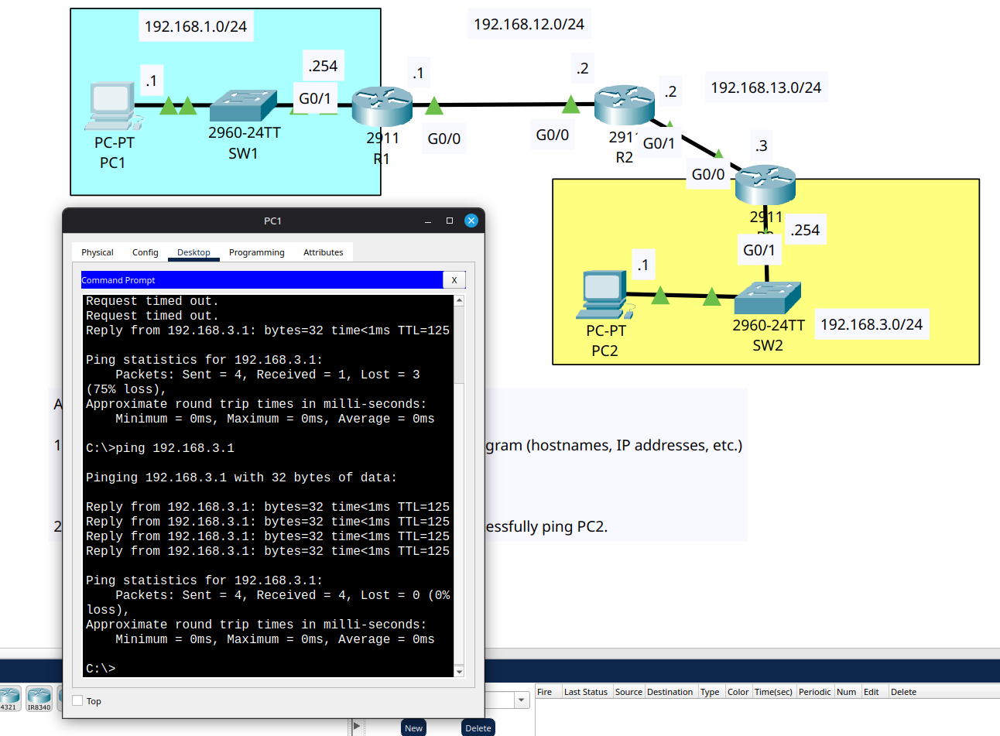

# Day 11

In this lab we had to configure static routes between the router daisy chain (R1-R2-R3) between PC1 LAN and PC2 LAN.

These are the abstract routes I configured:
- R1 -- PC2 LAN --> R2
- R1 -- (R2-R3 link LAN) --> R2
- R2 -- PC1 LAN --> R1
- R2 -- PC2 LAN --> R3
- R3 -- PC1 LAN --> R2
- R3 -- (R1-R2 link LAN) --> R2

See the .conf files for more details on subnets and IP addresses.

## What I observed

One thing I learnt from this lab is during the first ping, only the last echo request receives a reply. So the first ping happens over several ARP resolutions between the daisy chain of routers which causes the ping requests to consider the packet is lost due to the delay. After all the ARP resolutions are done, the final echo request of the first ping sequence receives a response and the first ping command gives 75% loss output (as first 3 are lost). From the first ping, all the other pings will have 100% success rate as ARP will have been resolved already (and stays for 5 minutes and refreshed when new packets arrive).

## Lab Screenshot

