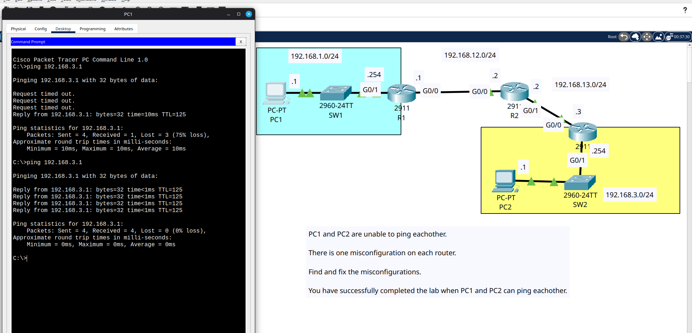

# Day 11 part 2

This is a lab where the routes were already configured as part 1 but there was one mistake in each router like incorrect route, missing route, or wrong IP address or submet and we had to fix it and make it look the same as part 1 so the PCs can ping each other.

## Lab Screenshot

