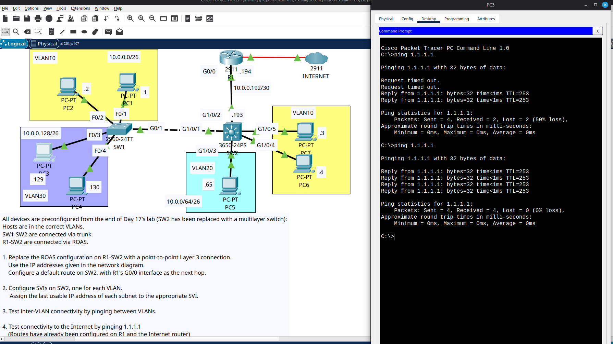

# Day 18 Lab

This is an advanced multi layer switching lab. We had to replace ROAS on Day-17 with a routed connection between the multi layer switch and the internet router. And the we had to configure SVIs, VLANs and trunking in the multi layer switch.

## Lab Screenshot

