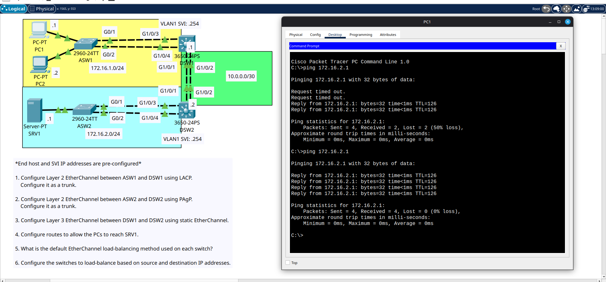

# Day 23 Lab

This is an etherchannel lab where we had to configure PAgP layer 2 etherchannel between 2 layer 2 switches, and a LACP layer 2 etherchannel between 2 layer 2 switches, and a static layer 3 etherchannel between 2 multilayer switches and set IP addresses to the layer 3 ether channels as well as static routing.

Topology:
```
(PC1 and PC2 LAN) <---> ASW1(Layer 2 switch) <==(layer 2 LACP Etherchannel)==> DSW1(layer 3 switch) <==(static layer 3 etherchannel)==> DSW2(layer 3 switch) <==(layer 2 PAgP etherchannel)==> ASW2(layer 2 switch) <---> (Server1 LAN)
```

Routes:
- DSW1--(Server1 LAN)-->DSW2(port-channel IP)
- DSW2--(PC1 and PC2 LAN)-->DSW1(port-channel IP)

## Lab Screenshot


