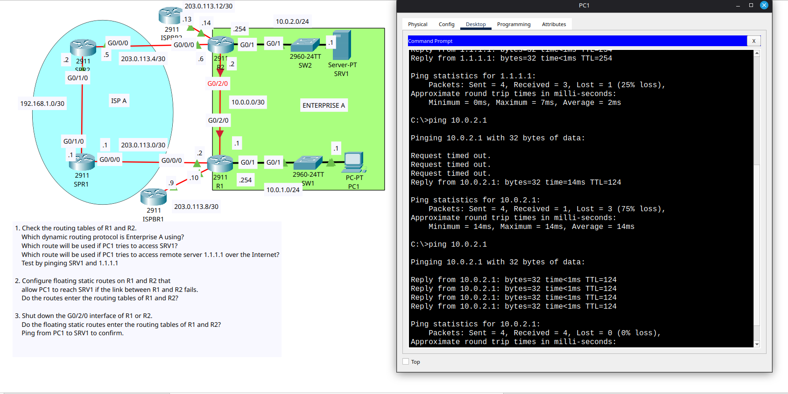

# Day 24 Lab

This is a floating static route configuration lab. The network has been setup and OSPF has been enabled. Our task is to configure floating static routes as backups to the 2 LANs over the ISP's network in case the direct link between R1 and R2 fails. There are only 2 commands you need to enter in this lab and they are in the .conf files. And we are supposed to try breaking the R1 and R2 link to see if the hosts can still communicate over the ISP network via our floating static routes.

## What I observed

When we break R1 and R2 link and expect our floating static routes to take over, the same router daisy chaining ARP delay problem we encountered in [Day-11 part 1](../Day-11/part-1-configuring/README.md#what-i-observed) arises and first 3 pings fail.

## Lab Screenshot

