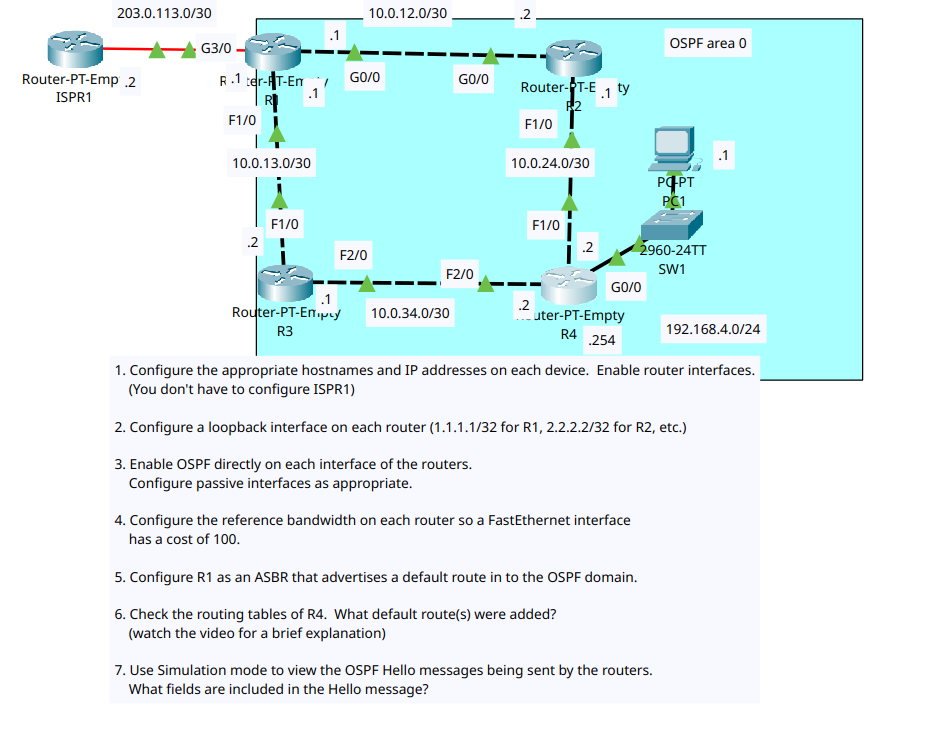

# Day 27 Lab

This is a lab where we had to configure OSPF on routers with varied interface cables connected along with setting a high reference ID so that cost for FastEthernet and anything higher is calculated properly.

## Final R4 Route Table

```
R4#show ip route
Codes: C - connected, S - static, I - IGRP, R - RIP, M - mobile, B - BGP
       D - EIGRP, EX - EIGRP external, O - OSPF, IA - OSPF inter area
       N1 - OSPF NSSA external type 1, N2 - OSPF NSSA external type 2
       E1 - OSPF external type 1, E2 - OSPF external type 2, E - EGP
       i - IS-IS, L1 - IS-IS level-1, L2 - IS-IS level-2, ia - IS-IS inter area
       * - candidate default, U - per-user static route, o - ODR
       P - periodic downloaded static route

Gateway of last resort is 10.0.24.1 to network 0.0.0.0

     4.0.0.0/32 is subnetted, 1 subnets
C       4.4.4.4 is directly connected, Loopback0
     10.0.0.0/30 is subnetted, 4 subnets
O       10.0.12.0 [110/110] via 10.0.24.1, 00:00:26, FastEthernet1/0
O       10.0.13.0 [110/200] via 10.0.34.1, 00:00:26, FastEthernet2/0
C       10.0.24.0 is directly connected, FastEthernet1/0
C       10.0.34.0 is directly connected, FastEthernet2/0
C    192.168.4.0/24 is directly connected, GigabitEthernet0/0
O*E2 0.0.0.0/0 [110/1] via 10.0.24.1, 00:00:36, FastEthernet1/0
```

Before reference bandwidth was changed, it had routes to 0.0.0.0 via both R2 and R3.

## Lab Screenshot


