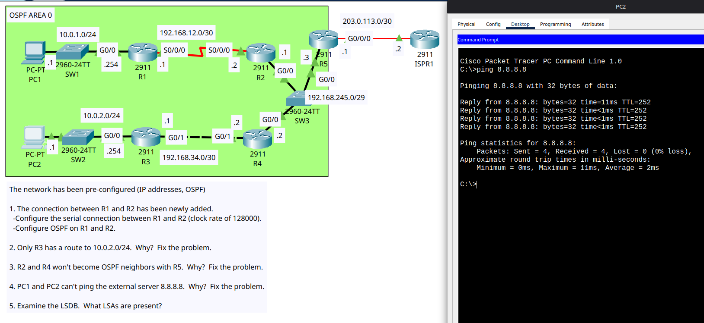

# Day 28 Lab

This is an OSPF troubleshooting lab where we had to troubleshoot the network according to the given steps.

2. R3 and R4 had OSPF link mismatch, R3 had POINT-TO-POINT link where R4 had BROADCAST, that is why they didn't share routes
3. R5 had different hello and dead intervals than R2 and R4
4. R5 did not have a default route to the internet and `default-information originate` was not set up in its OSPF config

## Lab Screenshot

