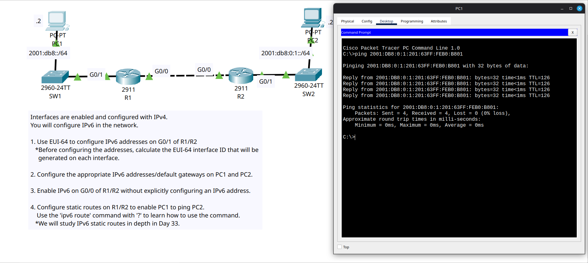

# Day 32 Lab

This is an IPv6 configuration lab where we had to additionally configure static routes in IPv6 along with end hosts and router interfaces.

## IPv6 addresses
- PC1: `2001:DB8::230:F2FF:FE36:4501/64`
- PC1 Default Gateway: `2001:DB8::230:F2FF:FE36:4502`
- PC2: `2001:DB8:0:1:201:63FF:FEB0:B801/64`
- PC2 Default Gateway: `2001:DB8:0:1:201:63FF:FEB0:B802`
- R1 G0/0 link-local address: `FE80::230:F2FF:FE36:4501` (volatile)
- R2 G0/0 link-local address: `FE80::201:63FF:FEB0:B801` (volatile)

## Lab Screenshot

