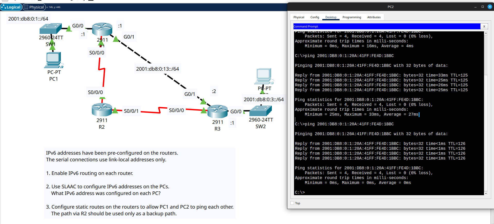
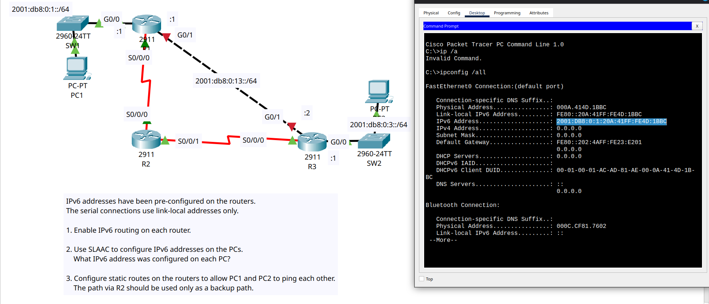

# Day 33 Lab

This is an IPv6 configuration lab where we had to set IPv6 routes as well as backup routes (floating static routes) and make the PCs use SLAAC to automatically generate IPv6 addresses.

## PC IPv6 Addresses

### PC1

```
   Link-local IPv6 Address.........: FE80::20A:41FF:FE4D:1BBC
   IPv6 Address....................: 2001:DB8:0:1:20A:41FF:FE4D:1BBC
```

### PC2

```
   Link-local IPv6 Address.........: FE80::240:BFF:FE69:9B18
   IPv6 Address....................: 2001:DB8:0:3:240:BFF:FE69:9B18
```

## Lab Screenshots

### 1. Main Route



### 2. Backup Route


