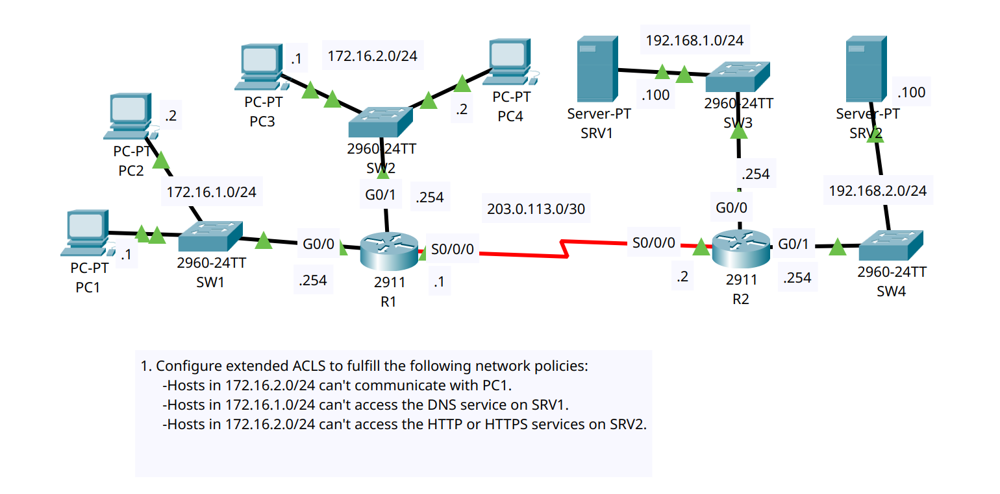

# Day 35 Lab

This is a basic extended ACL config lab where we had to configure 2 inbound extended ACLs on R1 as per the requirements. The current config works and has been tested for all edge cases.

## Lab Screenshot

