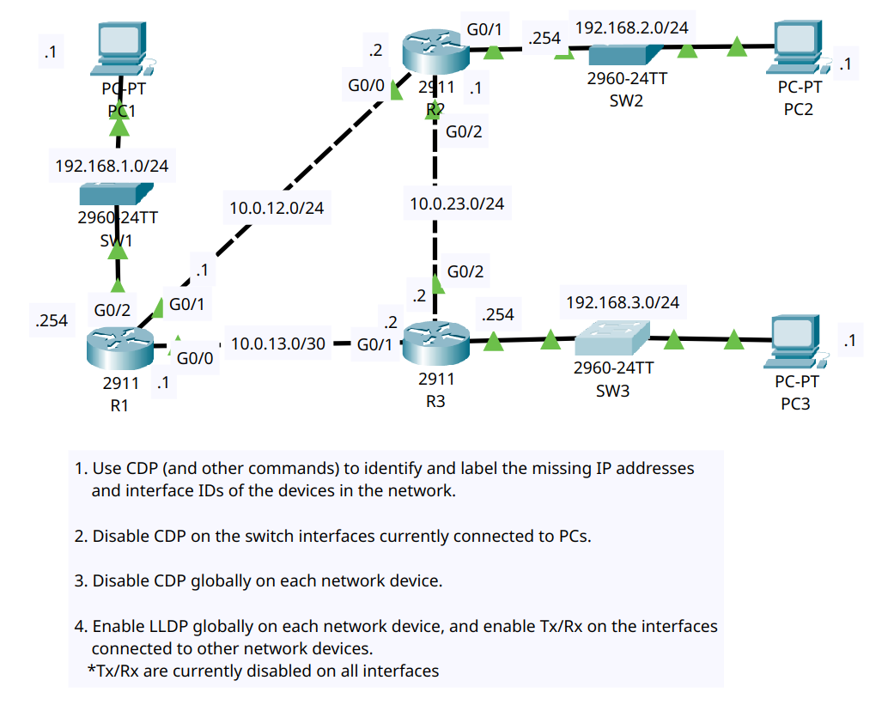

# Day 36 lab

In this lab we had to disable CDP on all devices using `(global config)#no cdp run` and enable LLDP on all devices and enable LLDP transmit and LLDP receive on all interfaces connected to other devices using `(global config)#lldp run` and `(interface config)#lldp transmit` + `(interface config)#lldp receive`.

## Lab Screenshot

