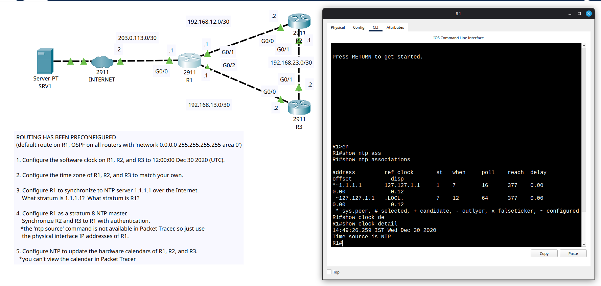

# Day 37 Lab

This is a NTP config lab where we had to set internet NTP server as upstream for R1 and R1 as upstream for R2 and R3 and also set up authentication between R1, R2 and R3. Password is `jeremysitlabs`.

## Lab Screenshot

