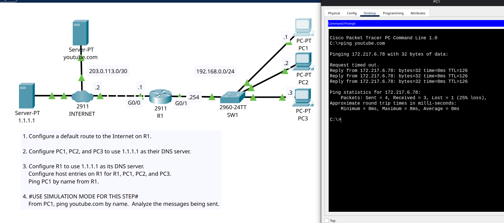

# Day 38 Lab

Basic DNS config lab, it was easy for me as I already did this in [real life](https://dev.to/shobanchiddarth/setting-up-pi-hole-as-a-custom-dns-server-on-my-home-lab-4jd7)

## Lab Screenshot

