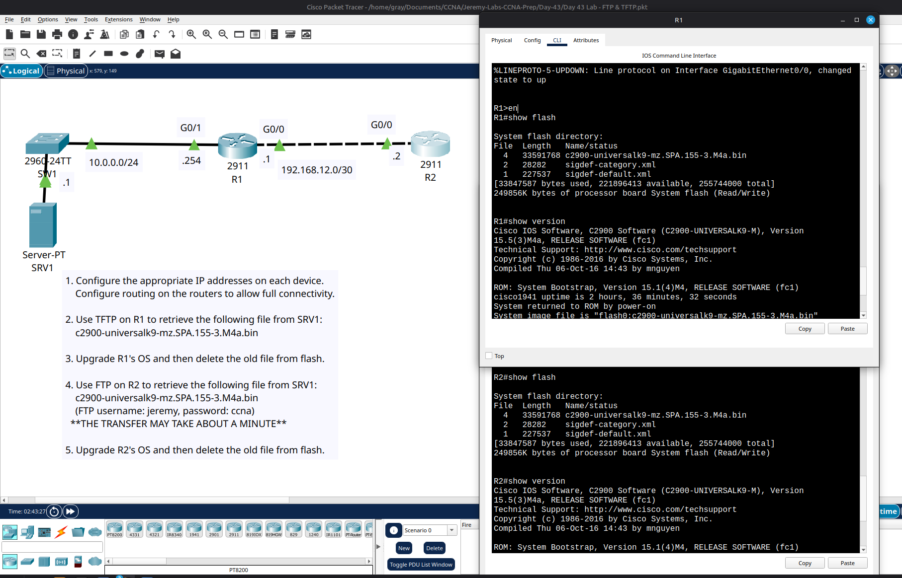

# Day 43 Lab

In this lab we had to upgrade the IOS version without changing much configurations. We had to get the file from the TFTP and FTP servers and boot with them and remove the old IOS file. We also had to set up IP addresses and static routes.

## Lab Screenshot

