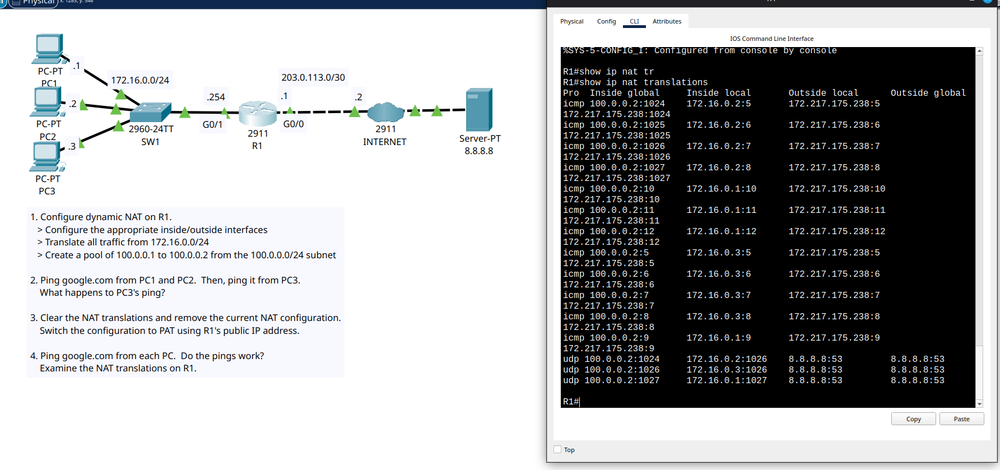

# Day 45 Lab

This is a dynamic NAT config lab. We first had to configure dynamic NAT without overload. Then test pinging from all 3 PCs when only 2 addresses were available. The last ping failed. And then we had to remove the dynamic NAT and setup PAT (dynamic NAT with overloading / masquerading). And then all the pings succeeded.

## Lab Screenshot

