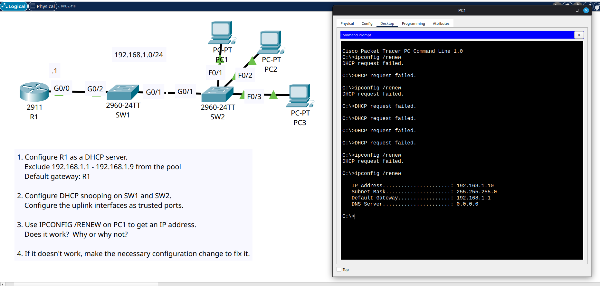

# Day 50 Lab

This day's lab is about configuring DHCP snooping on switches (After configuring DHCP server on R1) on switches SW1 and SW2 and debugging PCs not being able to get an IP address through DHCP.

The reason was `no ip dhcp snooping information option` was not configured on both switches. After doing that, PCs were able to get IP addresses.

## Lab Screenshot

