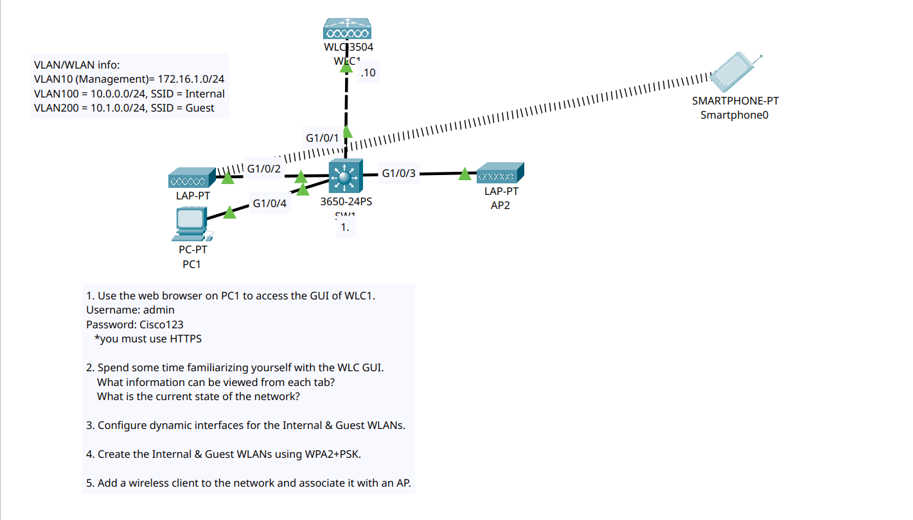

# Day 58

In this lab we had to learn and configure a Wireless LAN controller via its GUI by opening its IP address in the web browser. I configured dynamic interfaces for the WLANs and configured WLANs on those dynamic interfaces.

**Packet Tracer Limiations:**

1. Wireless LAN Controller is extremely limited and most features are greyed out
2. Even if a Wireless client connects to a non-management WLAN, it still gets an IP address in the management WLAN. However this is not the case in real life.

## Lab Screenshot

